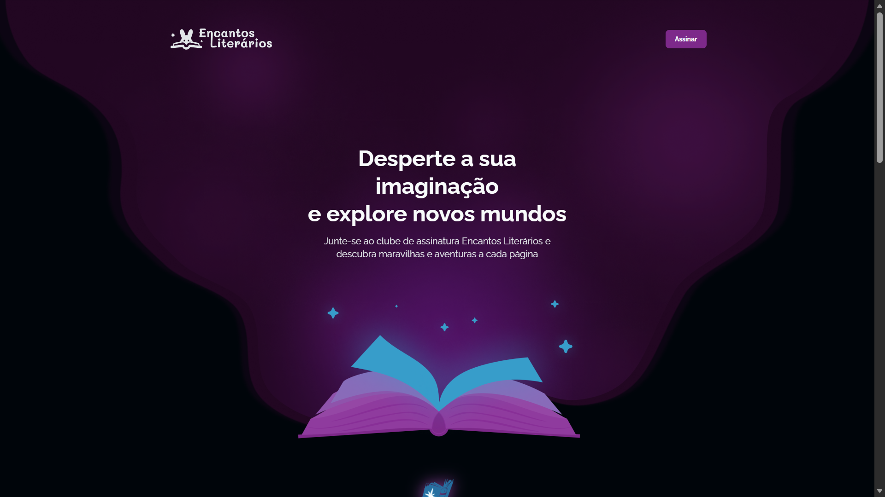
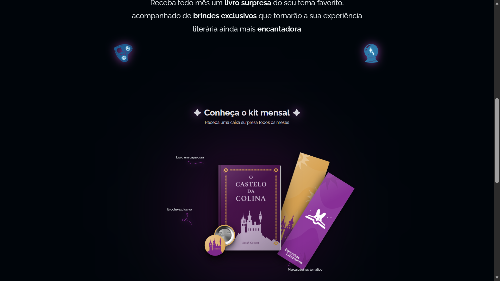
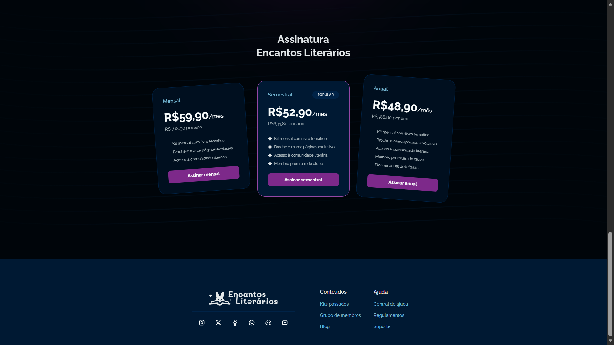

# 📖 Encantos Literários — Landing Page

**Visão Geral ⭐**

Este projeto é uma landing page para um clube de assinatura de livros fictício chamado **Encantos Literários**. O projeto foi cuidadosamente desenvolvido para apresentar uma experiência visual rica e detalhada, explorando conceitos avançados de HTML e CSS. Com um design responsivo e diversas animações e transições, a página busca encantar o usuário e destacar a magia por trás da leitura.

---

### 🖼️ Prévia do Projeto



<p align="center">
  
  
</p>

---

**🛠️ Tecnologias Utilizadas**

* **HTML5**: Estruturação semântica do conteúdo.
* **CSS3**: Estilização moderna, Flexbox, CSS Grid, variáveis CSS, animações e layouts responsivos.

---

**🚀 Sobre o Desenvolvimento**

O desenvolvimento desta landing page foi uma oportunidade para aprofundar conhecimentos e habilidades em CSS, superando desafios avançados de posicionamento de camadas (*z-index*) e explorando novas formas de estilização. As animações e transições são o grande diferencial do projeto, construídas com atenção minuciosa aos detalhes para criar uma atmosfera mágica e imersiva.

---

**🎨 Destaques de Estilo e Design**

* **Seção Hero (`#hero`)**: Apresenta fundo com gradiente e transição animada de opacidade no carregamento da página. O botão "Assinar" conta com efeito de transição suave ao passar o mouse.
* **Seção Surpresa (`#surprise`)**: Destaca os brindes da caixa com animações sutis nos ícones do livro, prancheta ouija e bola de cristal. Em telas maiores, os elementos flutuam e aumentam de escala no *hover*.
* **Seção do Mês (`#month`)**: Composição visual complexa com sobreposição precisa de camadas (*z-index*), exibindo o livro centralizado com marca-páginas e broche dispostos em posições e rotações estratégicas no CSS.
* **Seção de Preços (`#price`)**: Cards de assinatura dinâmicos com efeitos de escala, rotação sutil e alteração de cor ao passar o mouse para destacar o plano selecionado.
* **Rodapé (`footer`)**: Design temático com background estilizado, ícones de redes sociais com animações de preenchimento e links responsivos.

---

**💻 Recursos**

* **Layout Responsivo**: Interface adaptada para smartphones, tablets e desktops.
* **Animações e Transições**: Fluidez visual através de microinterações em CSS.
* **Detalhes Exclusivos**: Exibição condicional de elementos (como a classe `.desktop-only`) para otimizar a experiência em telas maiores.

---

**🔧 Como Executar**

1. Clone o repositório:
   ```bash
   git clone [https://github.com/LuanR7/encantos-literarios.git](https://github.com/LuanR7/encantos-literarios.git)
